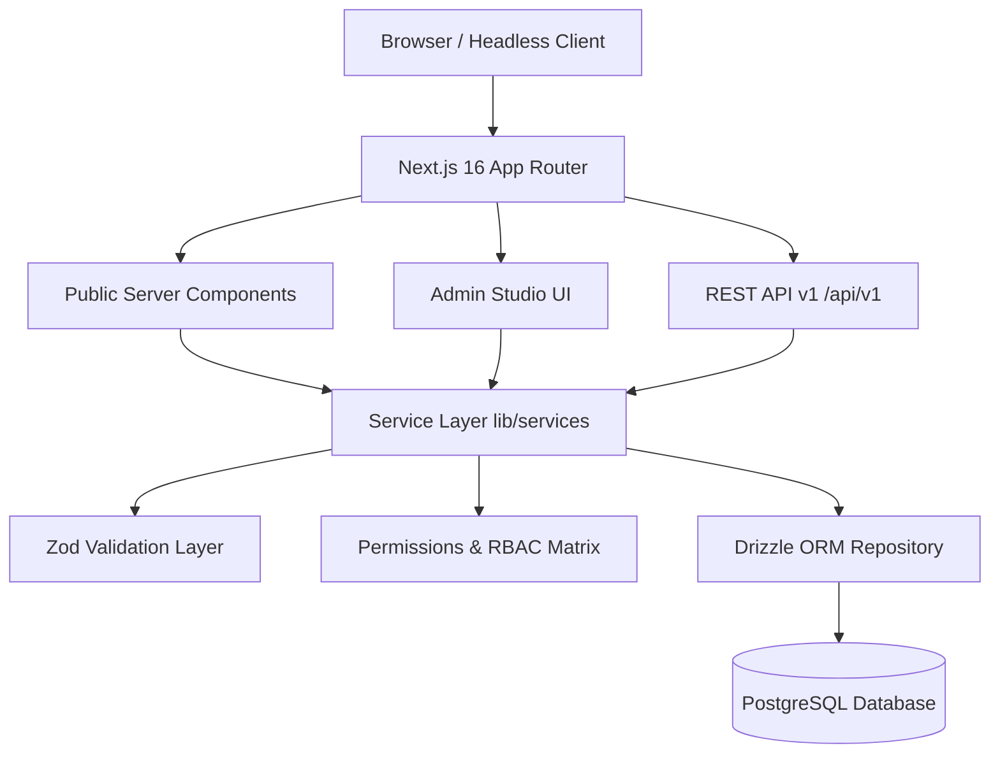

# Architecture & Design

ContentFlow follows a clean 4-tier modular architecture designed for high throughput, type safety, and zero presentation coupling.

## Architectural Highlights

1. **Server-First Data Fetching**:
   Public pages fetch data directly on the server through typed service functions, avoiding client-side waterfalls and minimizing JavaScript bundles.

2. **Isolated Service Layer**:
   Database queries and business logic are contained strictly in `lib/services/`. Server components and API route handlers never execute ad-hoc SQL directly.

3. **Multi-Driver External Services**:
   Storage (`lib/storage`), Email (`lib/email`), and Analytics (`lib/analytics`) are abstract interfaces supporting local fallback, Cloudinary/S3, and Resend.

4. **Tag-Based Cache Invalidation**:
   When an article is published or modified in the CMS, `revalidatePath` and cache triggers immediately update the edge cache.
